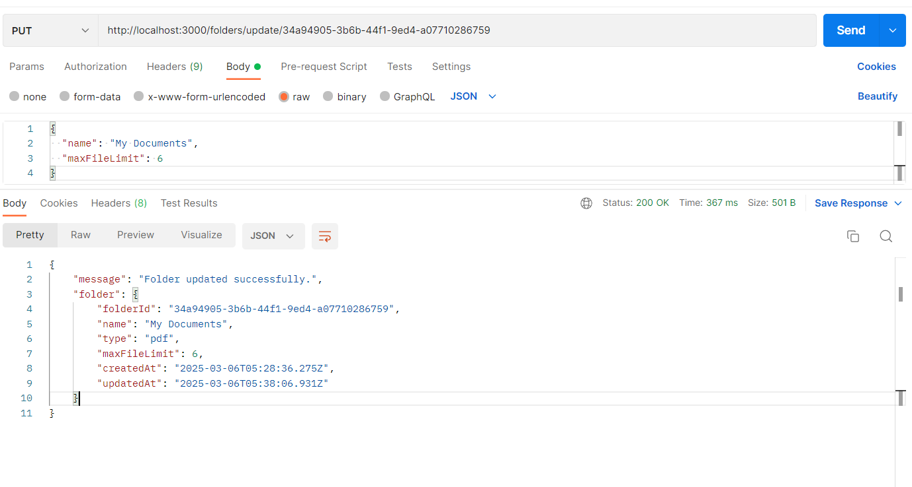

# FileForge - Document Management System

## 📌 Overview
FileForge is a robust **Document Management System (DMS)** that allows users to create folders, upload files, manage metadata, and organize their digital documents efficiently. It supports cloud storage via **Cloudinary** and provides various functionalities like searching, sorting, and filtering files.

## 🚀 Features
- 📂 **Folder Management**: Create, update, and delete folders with specific file type restrictions.
- 📄 **File Uploading**: Upload files to Cloudinary and store metadata in the database.
- 🔎 **File Retrieval**: Fetch files by folder, type, or other parameters.
- 📑 **Metadata Management**: View and update file descriptions.
- 📌 **Sorting & Filtering**: Sort files by size or upload date.
- 🗑 **File Deletion**: Securely delete files from the system.

## 🛠 Tech Stack
### Backend
- **Node.js** - JavaScript runtime environment
- **Express.js** - Web framework for building REST APIs
- **Sequelize** - ORM for database interactions
- **Supabase (PostgreSQL)** - Database for storing folder and file metadata

### Cloud Storage
- **Cloudinary** - For file uploads and storage

### Other Dependencies
- **Multer** - Middleware for handling file uploads
- **UUID** - For generating unique folder and file IDs
- **Axios** - For handling API requests (if needed)

## 🔧 Setup & Installation
1. **Clone the repository**
   ```sh
   git clone https://github.com/your-username/FileForge.git
   cd FileForge
   ```
2. **Install dependencies**
   ```sh
   npm install
   ```
3. **Configure environment variables** (Create a `.env` file)
   ```sh
   CLOUDINARY_CLOUD_NAME=your-cloud-name
   CLOUDINARY_API_KEY=your-api-key
   CLOUDINARY_API_SECRET=your-api-secret
   
   DB_USER=your-your-supabase-db-user 
   DB_PASSWORD-your-supabase-db-DB_PASSWORD
   DB_NAME-your-supabase-db-name 
   DB_HOST-your-supabase-db-DB_HOST
   DB_PORT-your-supabase-db-port
   ```
4. **Run database migrations**
   ```sh
   npx sequelize-cli db:migrate
   ```
5. **Start the server**
   ```sh
   npm start
   ```

 ## API Endpoints
### 1. Folder Management
#### Create a Folder
**Endpoint:** `POST /folders/create`

**Request:**
```json
{
  "name": "Project Documents",
  "type": "application/pdf"
}
```
**Response:**
```json
{
  "message": "Folder created successfully",
  "folder": {
    "folderId": "1234-5678-9101",
    "name": "Project Documents",
    "type": "application/pdf",
    "createdAt": "2025-03-06T12:00:00Z"
  }
}
```

#### Get All Folders
**Endpoint:** `GET /folders/all`

**Response:**
```json
[
  {
    "folderId": "1234-5678-9101",
    "name": "Project Documents",
    "type": "application/pdf"
  }
]
```

#### Get Folder by ID
**Endpoint:** `GET /folders/:folderId`

**Response:**
```json
{
  "folderId": "1234-5678-9101",
  "name": "Project Documents",
  "type": "application/pdf",
  "files": []
}
```

#### Update Folder
**Endpoint:** `PUT /folders/update/:folderId`


#### Delete Folder
**Endpoint:** `DELETE /folders/delete/:folderId`

---

### 2. File Management
#### Upload a File
**Endpoint:** `POST /folders/:folderId/files`

**Request:**
- **Headers**: `Content-Type: multipart/form-data`
- **Body**: Form-data with `file` (file upload) and `description` (string)

**Response:**
```json
{
  "message": "File uploaded successfully.",
  "file": {
    "fileId": "abcd-efgh-ijkl",
    "folderId": "1234-5678-9101",
    "name": "document.pdf",
    "type": "application/pdf",
    "size": 2048,
    "uploadedAt": "2025-03-06T12:05:00Z"
  }
}
```

#### Get Files in a Folder
**Endpoint:** `GET /folders/:folderId/files`

**Response:**
```json
[
  {
    "fileId": "abcd-efgh-ijkl",
    "folderId": "1234-5678-9101",
    "name": "document.pdf",
    "type": "application/pdf",
    "size": 2048,
    "uploadedAt": "2025-03-06T12:05:00Z"
  }
]
```

#### Get Files by Type
**Endpoint:** `GET /files?type=pdf`

**Response:**
```json
{
  "files": [
    {
      "fileId": "abcd-efgh-ijkl",
      "folderId": "1234-5678-9101",
      "name": "document.pdf",
      "type": "application/pdf",
      "size": 2048,
      "uploadedAt": "2025-03-06T12:05:00Z"
    }
  ]
}
```

#### Get File Metadata
**Endpoint:** `GET /folders/:folderId/files/metadata`

**Response:**
```json
{
  "files": [
    {
      "fileId": "abcd-efgh-ijkl",
      "name": "document.pdf",
      "size": 2048,
      "description": "Project Proposal"
    }
  ]
}
```

#### Update File Description
**Endpoint:** `PUT /folders/:folderId/files/:fileId`

**Request:**
```json
{
  "description": "Updated project document"
}
```
**Response:**
```json
{
  "message": "File description updated successfully",
  "file": {
    "fileId": "abcd-efgh-ijkl",
    "description": "Updated project document"
  }
}
```

#### Delete File
**Endpoint:** `DELETE /folders/:folderId/files/:fileId`

**Response:**
```json
{
  "message": "File deleted successfully"
}
```
 
# Database Design

This section outlines the database schema used in this project. The application uses a relational database with two main entities: Folders and Files.

## Data Models

### Folder Model

The `Folder` model represents a collection of files with specific properties:

| Field         | Type                        | Constraints                     | Description                              |
|---------------|-----------------------------|---------------------------------|------------------------------------------|
| folderId      | UUID                        | Primary Key, Not Null, Unique   | Unique identifier for each folder        |
| name          | STRING                      | Not Null, Not Empty             | Name of the folder                       |
| type          | ENUM('csv','img','pdf','ppt')| Not Null                      | Type of files the folder can contain     |
| maxFileLimit  | STRING                      | Not Null                        | Maximum number of files allowed          |
| createdAt     | DATE                        | Auto-generated                  | Timestamp when folder was created        |
| updatedAt     | DATE                        | Auto-generated                  | Timestamp when folder was last updated   |

### File Model

The `File` model represents individual files stored within folders:

| Field         | Type                        | Constraints                     | Description                              |
|---------------|-----------------------------|---------------------------------|------------------------------------------|
| fileId        | UUID                        | Primary Key, Not Null, Unique   | Unique identifier for each file          |
| folderId      | UUID                        | Foreign Key, Not Null           | Reference to parent folder               |
| name          | STRING                      | Not Null                        | Name of the file                         |
| description   | TEXT                        | Nullable                        | Optional description of the file         |
| type          | STRING                      | Not Null                        | Type/format of the file                  |
| size          | INTEGER                     | Not Null                        | Size of the file in bytes                |
| uploadedAt    | DATE                        | Not Null, Default: Current time | Timestamp when file was uploaded         |

## Relationships

- **One-to-Many**: A Folder can contain multiple Files (1:N)
  - The `folderId` in the `File` model references the `folderId` in the `Folder` model
  - When a Folder is deleted, all associated Files are automatically deleted (CASCADE)

## Entity-Relationship Diagram

```
+----------------+       +----------------+
|     Folder     |       |      File      |
+----------------+       +----------------+
| PK: folderId   |       | PK: fileId     |
| name           |       | FK: folderId   |
| type           | 1---< | name           |
| maxFileLimit   |       | description    |
| createdAt      |       | type           |
| updatedAt      |       | size           |
+----------------+       | uploadedAt     |
                         +----------------+
```

## Schema Details

- **Table Names**: "folders" and "files"
- **Timestamps**: 
  - Folder model includes automatic timestamps (createdAt, updatedAt)
  - File model does not use automatic timestamps, but tracks uploadedAt manually
- **Validation**: Folder names cannot be empty strings
- **Referential Integrity**: Foreign key constraints ensure data consistency
  - When a folder is deleted, all associated files are automatically deleted (CASCADE)
  - When a folder is updated, the changes are reflected in associated files (CASCADE)

## Technologies

This database schema is implemented using:
- Sequelize ORM

## 📝 License
This project is licensed under the **MIT License**.

